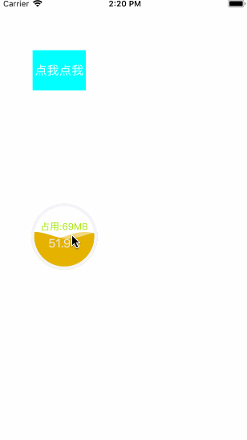

# TRMemoryWave
iOSDebug工具,实时监测fps/内存占用

## 0x00 效果

## 0x01 使用
'''
- (void)applicationDidBecomeActive:(UIApplication *)application {
dispatch_after(dispatch_time(DISPATCH_TIME_NOW, (int64_t)(3 * NSEC_PER_SEC)), dispatch_get_main_queue(), ^{
[TRMemoryWave show];
});
}
'''
